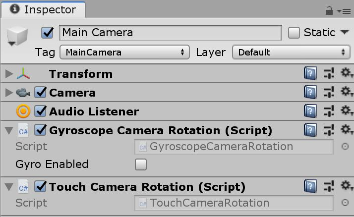

# Gyroscope and Touch Camera Rotation

# To test:
Just open Assets/SampleScene

# Add to your project:
Attach both Assets/GyroscopeCameraRotation.cs and Assets/TouchCameraRotation.cs to the camera gameobject.
Should work with any device that supports touch and gyroscope.
 
